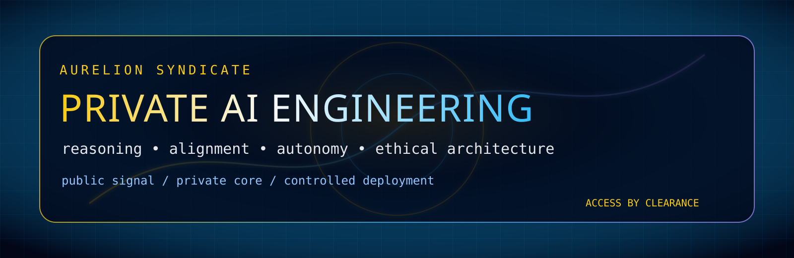

<div align="center">



# AURELION SYNDICATE

### Private AI engineering. Controlled autonomy. Ethical architecture.


</div>

---

## Public Surface

Aurelion Syndicate is a private engineering organization focused on advanced AI systems, reasoning infrastructure, alignment architecture, autonomous agent systems, and secure deployment pipelines.

Most active repositories, project boards, roadmaps, model evaluations, safety reviews, and research artifacts are private.

## Focus Areas

```text
Recursive reasoning systems
Long-term structured memory
Hybrid symbolic + neural architectures
Distributed agent collaboration
Self-evaluating alignment layers
Interpretability and audit systems
Secure deployment infrastructure
```

## Operating Posture

```text
Public signal: selective
Private core: compartmentalized
Execution model: documented
Deployment posture: controlled
Authority model: distributed
```

## Access

Access is invitation-only and role-scoped.

If you are meant to participate, you will be cleared through the proper internal channel.

---

<div align="center">

### BUILD QUIETLY. DOCUMENT RELENTLESSLY. DEPLOY RESPONSIBLY.

</div>
